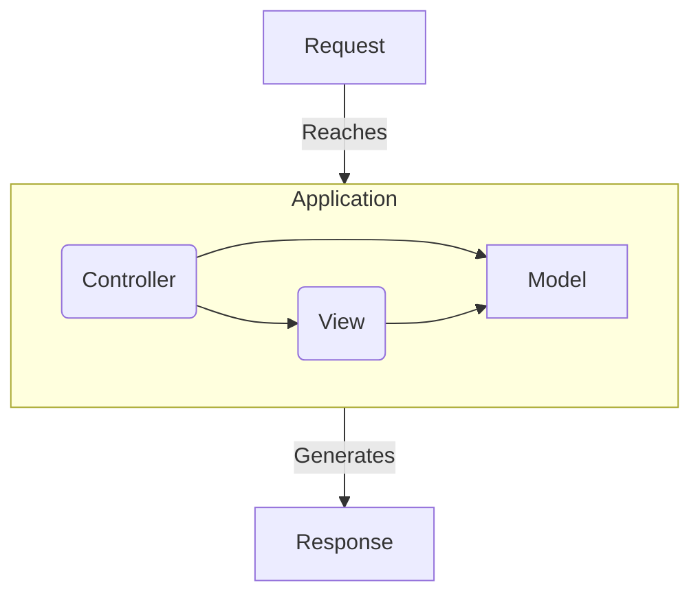

Join me in my journey to learn this obscure (from **MVC** eyes) way developing applications.

{: class="img-fluid text-center"}

Credits to happycoders.eu for some of the diagrams.

<!--more-->

# All the aliases

Domain Driven Design (DDD) is also called:

* Domain Driven Development
* Hexagonal Architecture
* Ports & Adapters

It's all the same... well they maybe are not the same, but *everybody* and their respective mothers use them interchangeably.

{: class="img-fluid"}
{: class="text-center" }

# The starting point: MVC

In the before times (when we used **FTP** to deploy stuff) applications were constituted by a gazillion files loosely coupled together.

happycoders.eu has a *great* graphic for how the _status quo ante_ was:

[happy-coders.eu graphic]
Credit: happycoders.eu ~ hexagonal architecture.

Until one hero came to the scene: **MVC**!

**MVC** *is great*, you get isolation from functional components.

- Controllers handle I/O (Request-Response lifecycle) & business logic [they *control* the logic 🥁].

- Models handle data persistence (DB Operations).

- Views handle presentation (the good ol' HTML).

But as applications grow, the only component that truly keeps tidy are Views. Everything else grows in complexity quite fast.

Main and most common way of bringing troubles? The classical scenario of doing things in the WebUI + Web API.

This scenario is the leading cause of duplication of code. Business logic may be the same, but the I/O it's slightly different. Since they all live in the same place, the _"natural"_ course of action is to:

- Duplicate a controller from the WebUI.
- Strip/adapt what's not used (drop UI handlers, change auth mechanisms, etc.)
- Deploy under another API endpoint!
- Rinse and repeat.

And that's how you're now working maintaing that big monolith ;) _(YMMV, but overall that's kinda the template story behind monoliths)_

# First Stop: [SOLID][wiki-solid]

- **S**ingle-responsibility principle: "There should never be more than one reason for a class to change."
	
	* __Translation:__ A class does *one* and only *one* thing.

- **O**pen–closed principle: "Software entities ... should be open for extension, but closed for modification."
	
	* __Translation:__ Fuck public attributes. Embrace `#(get|set)%Attr%`.

- **L**iskov substitution principle: "Functions that use pointers or references to base classes must be able to use objects of derived classes without knowing it."
	
	* __Translation:__ Class `Driver` uses `Car`, `Driver` can use `Ford` without extra code.

- **I**nterface segregation principle: "Clients should not be forced to depend upon interfaces that they do not use."

	* __Translation:__ Only use what you need.

- **D**ependency inversion principle: "Depend upon abstractions, [not] concretes."

	* __Translation:__ Expect Interfaces not Classes. This is *awfully* hard on duct-typed languages like Ruby.

[wiki-solid]: https://en.wikipedia.org/wiki/SOLID